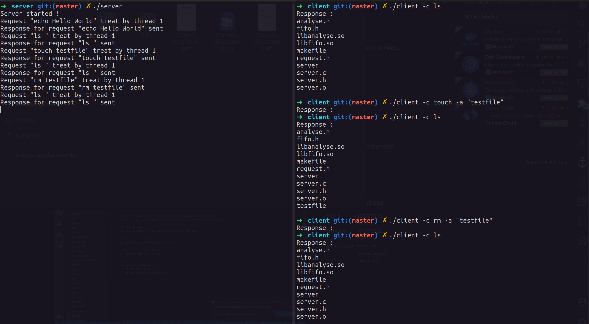

# C - Client Server

 Ce projet est un mini lanceur de commande, sous la forme d’un serveur qui répond
aux requêtes émises par des clients. Le serveur gère a la fois un nombre de client limité par le nombre de thread
que créé le démon. Lorsqu’aucun thread n’est disponible pour travailler le client reçoit un message pour le prévenir
qu’il devra alors retenter une connexion plus tard.

## Compilation

* Il faut ouvrir un terminal sur le "Projet SE" et faire `make` dans le dossier
server pour compiler le server .

* Ouvrir un autre terminal dans le dossier "client" et faire `make` pour le compiler.

## Utilisation

* Lancer le serveur pour écouter des requêtes:

    `./server`.

* Lancer  des commandes depuis le client :

  `./client  -c  <  commande  >  -a1 <  arguments  >`

Le résultat s’affiche à l’écran.

On  peut  lancer  plusieurs  clients  simultanément,  chacun  recevant  le  résultat  de  sa  commande  sur  son
terminal et se terminant aussitôt.

Pour mettre fin au serveur il suffit de faire `CTRL+C` dans le terminal du
démon.

Pour plus d'informations, consulter le [manuel technique](./manuel_technique.pdf)
